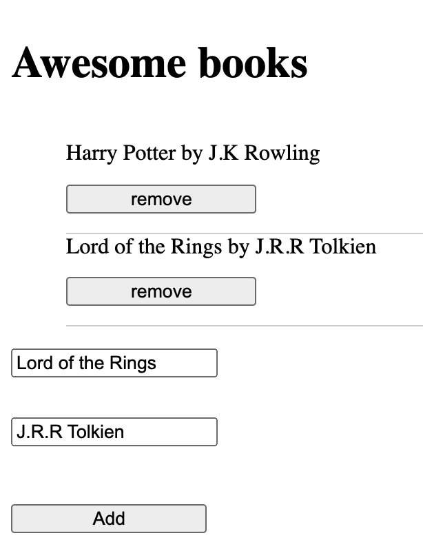

# Awesome Books

> This is a project created during my Microverse career where I needed to build a website that stores information about books starting the design with low wire-frame and building the project up from there.

## Built With

- HTML, CSS and Javascript

## Authors

👤 **Santiago Velosa**

- GitHub: [@vechicin](https://github.com/vechicin)
- Twitter: [@vechicin](https://twitter.com/vechicin)
- LinkedIn: [Santiago Velosa Arias](https://www.linkedin.com/in/santiago-velosa-arias-5b7543112/)

## 🤝 Contributing

Contributions, issues, and feature requests are welcome!

Feel free to check the [issues page](https://github.com/vechicin/Hello-Microverse/issues).

## Show your support

Give a ⭐️ if you like this project!

## Acknowledgments

- Willian Texeira for his help

## 📝 License

This project is [MIT](./MIT.md) licensed.
